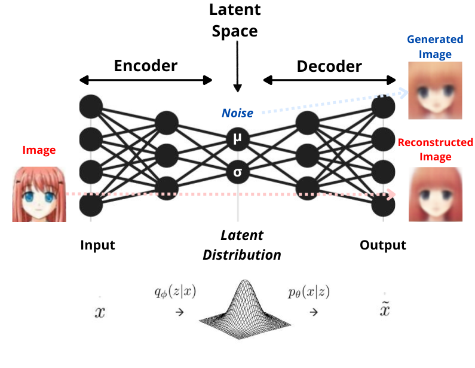
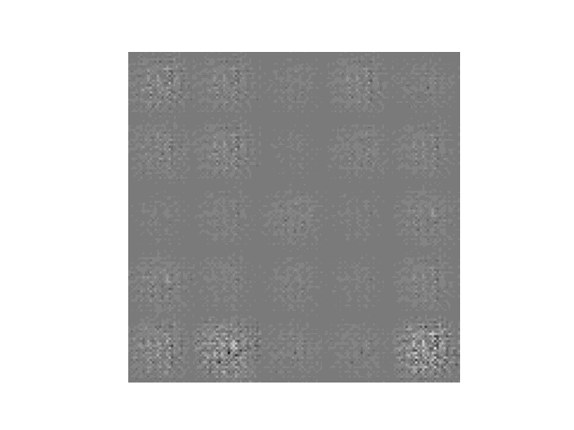

# <h1 align="center">**VAE**</h1>

 

This repository implements [VAE (Variational Autoencoder)](https://arxiv.org/abs/1312.6114) models, a probabilistic version of the [Autoencoder](https://github.com/JersonGB22/GenerativeDeepLearning) that compresses high-dimensional data into a more compact representation. Unlike traditional autoencoders, which assign input to a latent vector, VAEs assign input data to the parameters of a probability distribution, such as the mean and variance of a Gaussian distribution, thus creating a structured and continuous latent space. VAEs consist of an encoder and a decoder: the encoder produces matrices of means and covariances of a multivariate normal distribution with independent dimensions, while the decoder reconstructs the original data from the latent space. This approach has significant applications in image generation, data analysis, pattern recognition, and natural language processing, among other fields.

## **Implementations in TensorFlow and PyTorch**

Implementations have been conducted in TensorFlow and PyTorch, the two most widely used deep learning frameworks, to explore the capabilities of Variational Autoencoder (VAE) models, particularly Convolutional VAE models. Each implementation provides detailed insights into the differences and similarities between these frameworks, offering practical perspectives for professionals in the field.

## **Datasets Used**

- **Anime Faces**: Dataset containing 63,565 color images of [anime faces by MckInsey666](https://github.com/bchao1/Anime-Face-Dataset).

- **MNIST**: This dataset consists of 70,000 grayscale images of handwritten digits ranging from 0 to 9.

## **Results achieved by the models**

    

        
        
    

*You can observe how generation improves as the epochs progress. For better results, you can visit the various GAN models in my [repository](https://github.com/JersonGB22/GenerativeDeepLearning).*

## **Technological Stack**
 

## **Contact**

